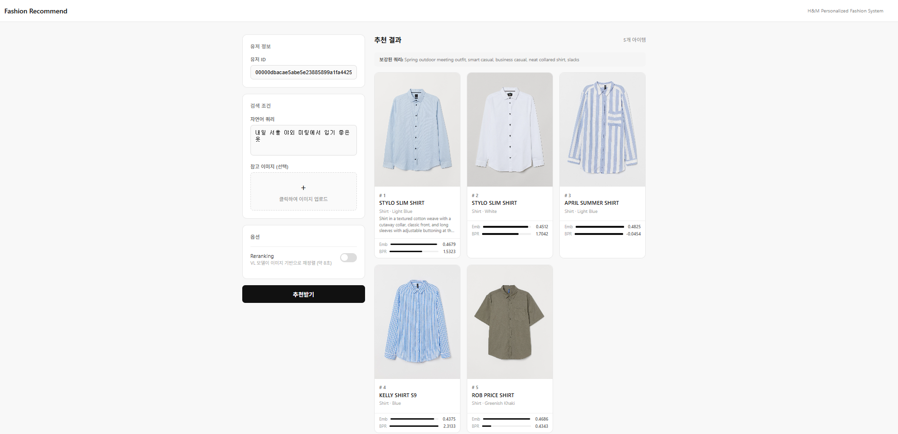
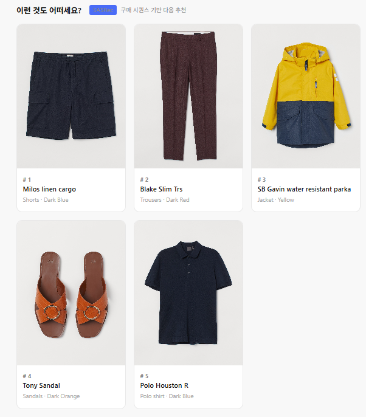
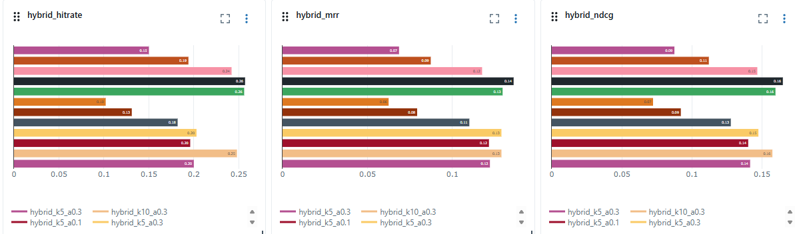

## Dataset
- H&M Personalized Fashion Recommendations (Kaggle)
- 105,542 items / 1,371,980 users / 31,788,324 transactions
- BPR 학습: 1,240,163 users / 91,798 items / 21,793,296 interactions (2018~2020 구매 데이터, 시간 기준 80% split)

## Tech Stack
- **Language**: Python, PyTorch
- **Embedding**: Qwen3-VL-Embedding-2B (multimodal, text + image)
- **Vector DB**: ChromaDB (105,542 items)
- **Collaborative Filtering**: BPR (Bayesian Personalized Ranking), SASRec (Sequential)
- **VL Reranker**: Qwen3-VL-Reranker-2B (local, 128×128 최적화) + article description 기반 추천 이유 제공
- **Query Agent**: LangChain + Gemini 2.5 Flash (날씨/트렌드/일정 툴 호출)

## Serving Latency
| 단계 | rerank 없음 | rerank 있음 |
|------|------------|------------|
| 쿼리 보강 (Gemini) | 5~7초 | 5~7초 |
| 쿼리 임베딩 | 0.5초 | 0.2초 |
| ChromaDB 검색 | 0.7초 | 0.1초 |
| BPR 스코어링 | 0.01초 | 0.01초 |
| reranker 추론 | - | 3.2초 |
| **전체** | **~8초** | **~11초** |

> Reranker 이미지 해상도 256×256 → 128×128 최적화로 추론 시간 16초 → 3.2초로 단축 (3.5배)  
> 쿼리 보강 Gemini API(5~7초) → Qwen3-VL-2B-Instruct 로컬 추론으로 대체 시 0.7초로 단축 가능.  
> VRAM 16GB 제약 (Embedding + Reranker 선점)으로 미적용. 추천 이유 생성은 LLM 생성 대신 article description으로 대체.

## Evaluation Results

### Hybrid vs Baseline (Leave-one-out, 1,000 users, 105,542 items)
| Model | HitRate@5 | HitRate@10 |
|-------|-----------|------------|
| BPR only | 0.005 | 0.010 |
| Embedding only | 0.079 | 0.121 |
| **Hybrid (alpha=0.3)** | **0.211** | **0.264** |

> Embedding only 대비 Hybrid: HitRate@5 기준 **+167%** 향상

### Embedding Ablation — CLIP vs Qwen3-VL (Leave-one-out, 1,000 users, 10,000 items)
| Model | HitRate@5 | HitRate@10 |
|-------|-----------|------------|
| CLIP (fashion-clip) | 0.331 | 0.426 |
| Qwen3-VL v1 (색깔 포함) | **0.489** | **0.600** |
| Qwen3-VL v2 (색깔 제외) | 0.388 | 0.477 |

> 텍스트 구성 ablation: 색깔 정보 포함 시 HitRate@5 기준 **+26%** 향상  
> Qwen3-VL이 CLIP 대비 HitRate@5 기준 **+48%** 우세

### Alpha Ablation — Hybrid Score (1,000 users 고정)

> HitRate@10에서는 alpha=0.1이 소폭 우세하나, NDCG와 MRR 전 구간에서 alpha=0.3이 최적.  
> 종합적으로 **alpha=0.3 (Emb 30% + BPR 70%)** 채택.

| alpha | HitRate@5 | HitRate@10 | NDCG@5 | NDCG@10 | MRR@5 | MRR@10 |
|-------|-----------|------------|--------|---------|-------|--------|
| 0.1 | 0.2020 | **0.2700** | 0.1362 | 0.1584 | 0.1144 | 0.1237 |
| **0.3** | **0.2160** | 0.2650 | **0.1470** | **0.1629** | **0.1243** | **0.1309** |
| 0.5 | 0.1810 | 0.2350 | 0.1215 | 0.1389 | 0.1020 | 0.1091 |
| 0.7 | 0.1230 | 0.1900 | 0.0811 | 0.1029 | 0.0674 | 0.0764 |
| 0.9 | 0.0900 | 0.1460 | 0.0585 | 0.0760 | 0.0482 | 0.0551 |

### SASRec — 시퀀스 기반 다음 구매 예측 (100 candidates, 1 positive + 99 negative)
| Model | HitRate@5 | NDCG@5 | MRR@5 | HitRate@10 | NDCG@10 | MRR@10 |
|-------|-----------|--------|-------|------------|---------|--------|
| SASRec | 0.0940 | 0.0705 | 0.0628 | 0.1090 | 0.0752 | 0.0647 |

> BPR/Embedding과 태스크가 달라 직접 비교 불가. SASRec은 시퀀스 기반 다음 구매 예측,  
> BPR/Embedding은 유저 취향 기반 추천으로 역할이 다름.  
> SASRec은 연관 추천("이런 것도 어떠세요?") 섹션에 별도 활용.
> 쿼리 맥락 반영을 위해 SASRec top50 후보에서 쿼리 임베딩 유사도로 재정렬하는 hybrid 구조 적용.

## Roadmap
- [x] v1: 자연어 입력 → FAISS retrieval → Qwen2.5 reranking (텍스트 전용)
- [x] v1: 유저 구매 이력 임베딩 평균 기반 개인화 추천
- [x] v2: 멀티모달 전환 (Qwen3-VL-Embedding-2B + ChromaDB + 이미지)
- [x] v2: 한국어 추천 이유 생성 (Qwen3-VL-2B-Instruct)
- [x] v3: BPR 협업 필터링 + Hybrid reranking
- [x] v3: 콜드 스타트 처리 (구매 이력 없는 유저 → 임베딩 기반 fallback)
- [x] v3: CLIP vs Qwen3-VL embedding ablation 실험
- [x] v3: 날씨/일정/장소 기반 오늘의 옷 추천 (LangChain Agent)
- [x] v4: NDCG@K, MRR 평가 지표 추가
- [x] v4: SASRec 기반 시퀀스 모델 도입 → 연관 추천 섹션 활용
- [x] v4: 추천 이유 생성 → article description으로 대체 (VRAM 제약 및 latency 최적화)
- [x] v4: Reranker 128×128 최적화 (16초 → 3.2초)
- [x] v4: 인기 편향 완화 (popularity^0.01 패널티 + epsilon-greedy exploration)
- [x] v5: MLflow 실험 추적 (alpha/k 조합별 HitRate, NDCG, MRR 기록)
- [x] v5: Docker 컨테이너화 (CUDA 12.6 기반 GPU 서빙 환경 구축)
- [ ] v5: Airflow DAG 기반 재학습 파이프라인 자동화 (신규 데이터 → BPR 재학습 → 평가 → 모델 교체)
- [ ] v?: 실제 유저 로그인 + 히스토리 수집, Hard negative mining 적용

